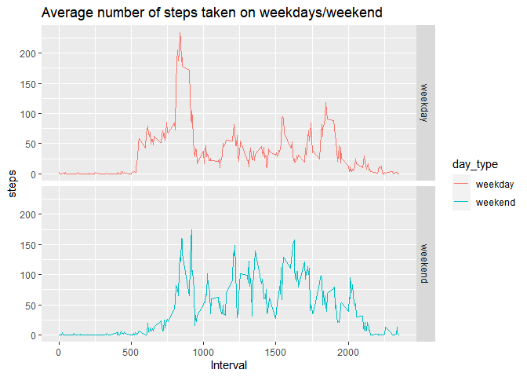

## Part 1: Loading and preprocessing the data

```r
library(knitr)
library(ggplot2)
opts_chunk$set(echo = TRUE)

#Data without any processing
full_data <- read.csv("activity.csv")
head(full_data)
```

```
##   steps       date interval
## 1    NA 2012-10-01        0
## 2    NA 2012-10-01        5
## 3    NA 2012-10-01       10
## 4    NA 2012-10-01       15
## 5    NA 2012-10-01       20
## 6    NA 2012-10-01       25
```

```r
# Data without any missing values
clean_data <- na.omit(full_data)
head(clean_data)
```

```
##     steps       date interval
## 289     0 2012-10-02        0
## 290     0 2012-10-02        5
## 291     0 2012-10-02       10
## 292     0 2012-10-02       15
## 293     0 2012-10-02       20
## 294     0 2012-10-02       25
```

## Part 2: What is mean total number of steps taken per day?
For this part of the assignment, it was stipulated that missing values could be ignored, so the 'full_data' was used.


```r
# Calculate the total number of steps taken per day
steps_per_day <- aggregate(steps ~ date, full_data, sum)

# Create a histogram of number of steps per day
hist(steps_per_day$steps, main = "Total steps taken each day", 
     xlab = "Steps per day")
```

<!-- -->

```r
# Calculate the mean and median of the total number of steps taken per day
round(mean(steps_per_day$steps))
```

```
## [1] 10766
```

```r
median(steps_per_day$steps)
```

```
## [1] 10765
```

## Part 3: What is the average daily activity pattern?
In this part, since it was not stipulated that missing values could be ignored, it was used the 'clean_data'.

```r
# Calculate average steps per interval for all days 
avg_steps_per_interval <- aggregate(steps ~ interval, clean_data, mean)
# Plot the time series with appropriate labels and heading
plot(avg_steps_per_interval$interval, avg_steps_per_interval$steps, 
     type='l', col=1, main="Average number of steps taken by Interval", 
     xlab="Time Intervals", ylab="Average number of steps")
```

<!-- -->

```r
# Identify the interval index which has the highest average steps
interval_idx <- which.max(avg_steps_per_interval$steps)

# Identify the specific interval and the average steps for that interval
print (paste("The interval with the highest average steps is ", 
             avg_steps_per_interval[interval_idx, ]$interval, 
             " and the number of steps for this interval is ", 
             round(avg_steps_per_interval[interval_idx, ]$steps, digits = 1)))
```

```
## [1] "The interval with the highest average steps is  835  and the number of steps for this interval is  206.2"
```

## Part 4: Imputing missing values
It was used the strategy of replacing the missing NA values with the average steps by interval across all  days.


```r
# Calculate the number of rows with missing values
missing_values <- full_data[!complete.cases(full_data), ]
nrow(missing_values)
```

```
## [1] 2304
```

```r
#Replacing the NA values with the average steps by interval
for (i in 1:nrow(full_data)) {
  if(is.na(full_data$steps[i])) {
    val <- avg_steps_per_interval$steps[which(avg_steps_per_interval$interval == full_data$interval[i])]
    full_data$steps[i] <- val 
  }
}

# Aggregate the steps per day with the imputed values
new_data <- aggregate(steps ~ date, full_data, sum)
# Draw a histogram of the value 
hist(new_data$steps, main = "Histogram of total number of steps per day (Removed NA data)", 
     xlab = "Steps per day")
```

<!-- -->

```r
# Calculate the mean and median of the total number of steps taken per day
mean(new_data$steps)
```

```
## [1] 10766.19
```

```r
## [1] 10766
median(new_data$steps)
```

```
## [1] 10766.19
```

```r
## [1] 10766.19
```
**Do these values differ from the estimates from the part 2 of the assignment?What is the impact of imputing missing data on the estimates of the total daily number of steps?**

From the  part 2 the mean and median values were 10766 and 10765 respectively. It can be noticed that the NA values do not influence much impact in the mean and median values.

## Part 5: Are there differences in activity patterns between weekdays and weekends?

```r
Sys.setlocale("LC_TIME", "English")
```

```
## [1] "English_United States.1252"
```

```r
data_week <- clean_data

# Create a new factor variable in the dataset with two levels (“weekday” and “weekend”) indicating whether a given date is a weekday or weekend day.
data_week$day <- as.factor(weekdays(as.Date(data_week$date)))
data_week$day_type <- as.factor(ifelse(data_week$day == "Saturday" | data_week$day == "Sunday", "weekend", "weekday"))
head(data_week)
```

```
##     steps       date interval     day day_type
## 289     0 2012-10-02        0 Tuesday  weekday
## 290     0 2012-10-02        5 Tuesday  weekday
## 291     0 2012-10-02       10 Tuesday  weekday
## 292     0 2012-10-02       15 Tuesday  weekday
## 293     0 2012-10-02       20 Tuesday  weekday
## 294     0 2012-10-02       25 Tuesday  weekday
```

```r
data_week_date <- aggregate(steps ~ interval + day_type, data_week, mean)
head(data_week_date)
```

```
##   interval day_type     steps
## 1        0  weekday 2.3333333
## 2        5  weekday 0.4615385
## 3       10  weekday 0.1794872
## 4       15  weekday 0.2051282
## 5       20  weekday 0.1025641
## 6       25  weekday 1.5128205
```

```r
#Plot of the two graphs by day type
ggplot(data=data_week_date, aes(colour=day_type, x=interval, y=steps)) + geom_line()+labs(x="Interval", y="steps", title="Average number of steps taken on weekdays/weekend") + facet_grid(day_type ~ .)
```

<!-- -->

By looking at the graphs it is possible to notice that there is a peak of physical activity (probably running) on weekdays in the morning, while on weekends the user probably did not practice intense physical activity.
